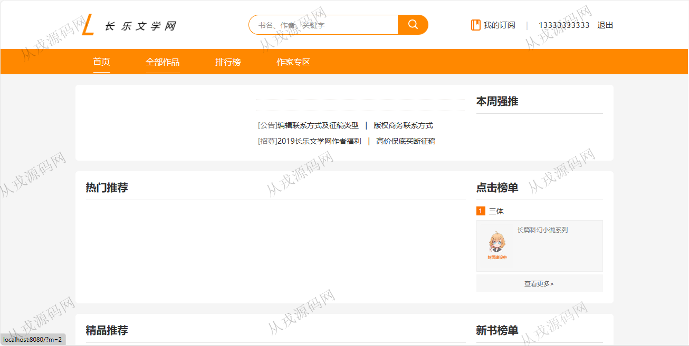
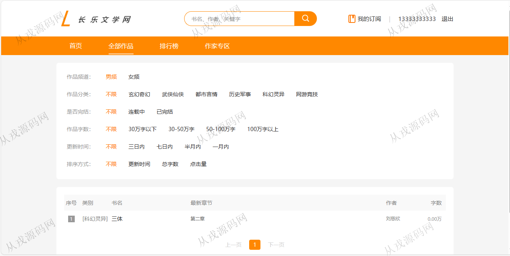
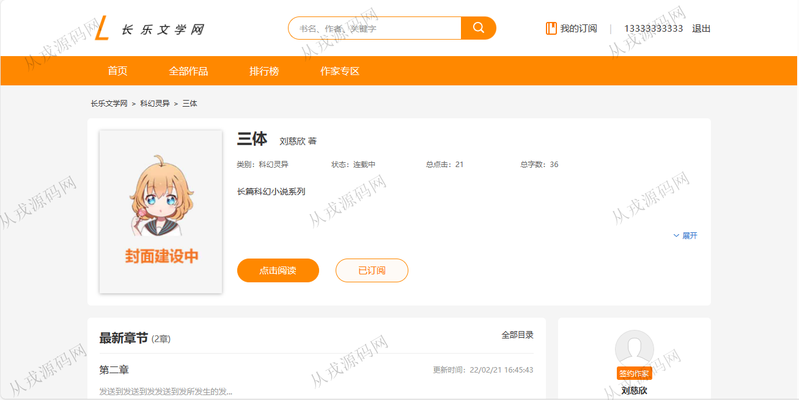
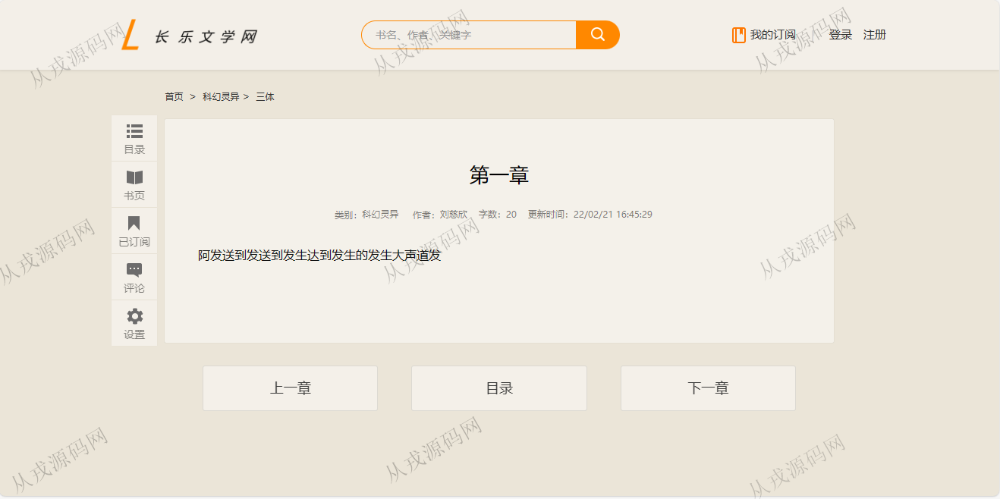
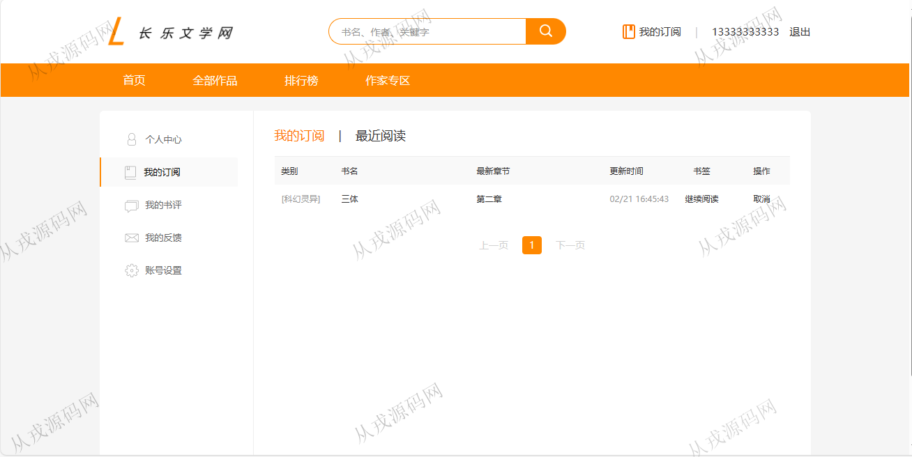
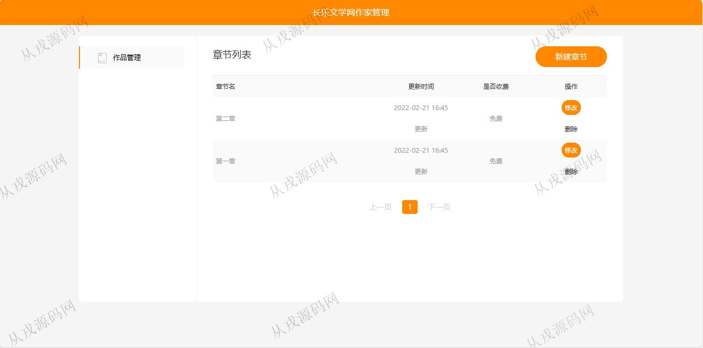
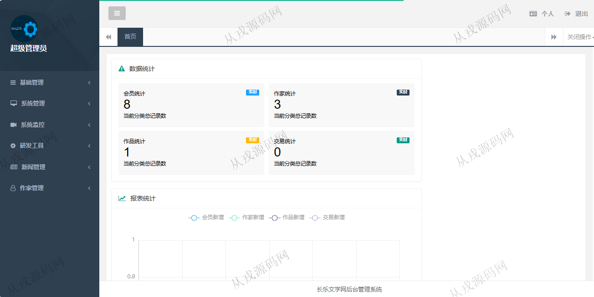
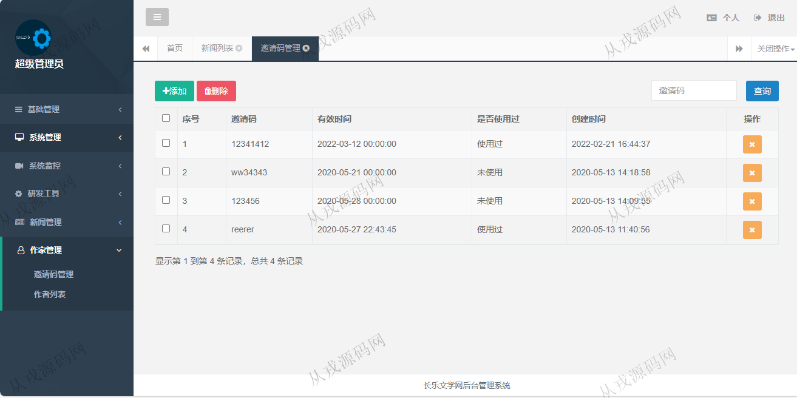
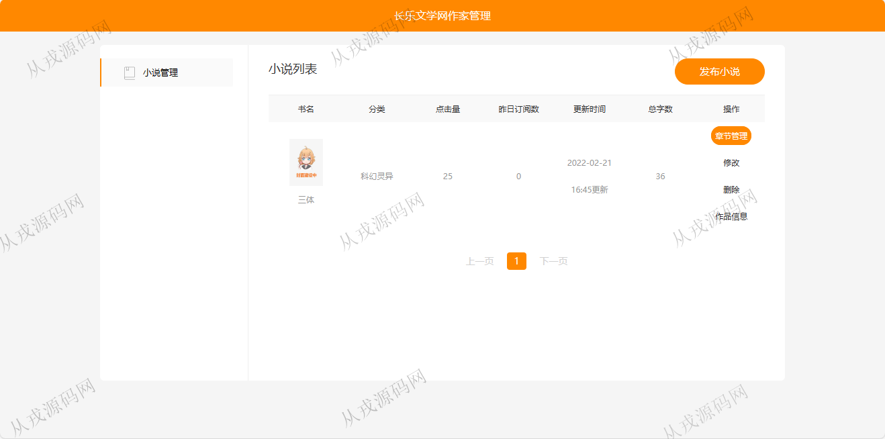

<h1 align="center">88.长乐文学小说管理系统</h1>

- <b>完整代码获取地址：从戎源码网 ([https://armycodes.com/](https://armycodes.com/))</b>
- <b>技术探讨、资料分享，请加QQ群：692619798</b> 
- <b>作者微信：19941326836  QQ：952045282</b> 
- <b>承接计算机毕业设计、Java毕业设计、Python毕业设计、深度学习、机器学习</b>
- <b>选题+开题报告+任务书+程序定制+安装调试+论文+答辩ppt 一条龙服务</b>
- <b>所有选题地址 ([https://github.com/YuLin-Coder/AllProjectCatalog](https://github.com/YuLin-Coder/AllProjectCatalog)) </b>

## 项目介绍
基于springboot的长乐文学小说管理系统：前端 html、jquery、layui，后端 maven、springmvc、spring、mybatis，角色分为管理员、用户；集成书籍在线阅读、订阅、书籍发布、作家专区等功能于一体的系统。

## 功能介绍

### 用户

- 基本功能：登录，注册，退出，账号信息查看与修改，密码修改
- 网站首页：导航栏，全局搜索，热门推荐，点击榜单，新书榜单，精品推荐
- 全部作品：作品分类导航，作品列表
- 排行榜：点击榜，新书榜，更新榜，评论榜
- 作家专区：小说列表，发布小说，章节管理，章节内容编辑
- 书籍：书籍详情，在线阅读，评论，书籍目录导航，阅读主题设置，正文字体设置，字体大小设置，订阅
- 我的订阅：订阅列表，最近阅读列表，继续阅读
- 个人中心：我的书评，我的反馈，写反馈

### 管理员

- 基础管理：数据字典，文件管理
- 系统管理：用户管理，角色管理，系统菜单，部门管理，数据权限
- 系统监控：在线用户，系统日志，运行监控
- 新闻管理：类别管理，新闻列表
- 作家管理：邀请码管理，作者列表

## 环境

- <b>IntelliJ IDEA 2021.3</b>

- <b>Mysql 5.7.26</b>

- <b>Maven</b>

- <b>JDK 1.8</b>

- <b>redis 3.0</b>

## 运行截图

